# Task D. Application In Server
1. - Monolith merupakan sebuah pendekatan tradisional dalam pembangunan sebuah aplikasi. Aplikasi monolitik terbentuk sebagai satu kesatuan kode yang tidak dapat dipisahkan satu dan lainnya.  Salah satu karakter sistem arsitektur monolitik adalah saat pemrogram ingin melakukan perubahan pada sistem monolitik, pemrogram harus mengubah satu kesatuan kode secara menyeluruh dan bersamaan.
    - Jika monolith adalah sebuah arsitektur aplikasi secara kesatuan atau tunggal, maka microservices adalah sebaliknya. Microservices terbagi menjadi unit pecahan yang lebih kecil dan spesifik. Setiap unitnya terpisah dan memiliki sistem beserta database sendiri untuk beroperasi dan menggunakan mekanisme API untuk terhubung dengan unit lainnya.
***
## Deploy Wayshub 
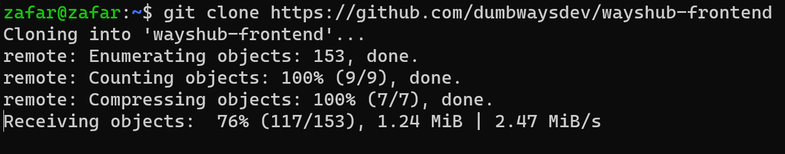
>Sebelum memulai pastikan untuk instalasi node js, kalau sudah masukan link aplikasi yang akan di deploy dari git hub sintaksnya sebagai berikut
```https://github.com/dumbwaysdev/wayshub-frontend```

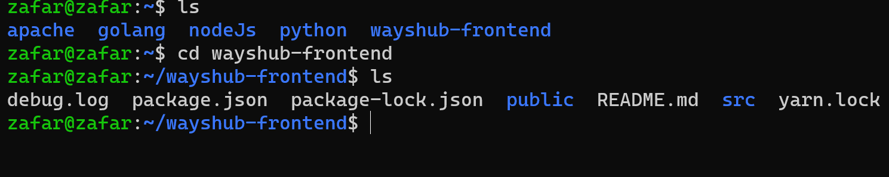
>Jika semua sudah ter-instal dari nodejs dan aplikasi yang akan di deploy kita akan cek terlebih dahulu apakah sudah ter-install untuk web nya dengan sintaks 'ls' jika sudah ada file bernama 'wayshub-frontend' silakan masuk ke dalam folder nya 

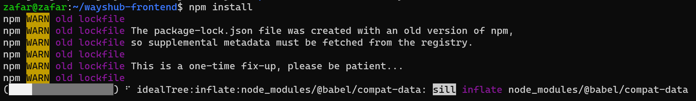
>Nah jika sudah maasuk baca readme.md yang ada di dalam foldernya, jika sudah silakan instal 'npm install' untuk menginstal keseluruhan yang diperlukan yang ada di package.json 

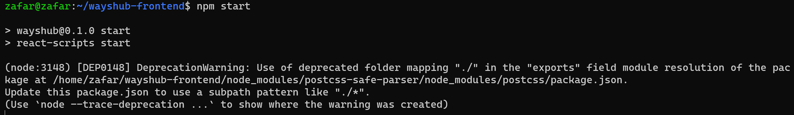
>Jika sudah bisa di jalankan untuk menjalankan cukup dengan perintah 
```npm start``` 

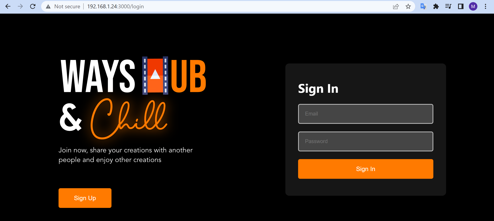
>Jika sudah silakan jalanin di web browser dengan memasukan ipubuntu:3000 
***
## Deploy Golang Web
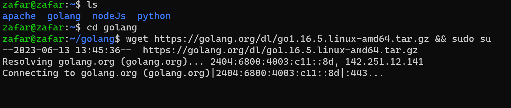
>Sebelum menginstall golang yang perlu di perhatikan kita harus membuat sebuah folder agar tidak menjadi menumpuk dan bertujuan rapih agar suatu saat kita mencari folder golang juga ga lupa menaruh file golang, jika sudah bisa menginstal engine untuk golang nya terlebih dahulu dengan sintaks 

```wget https://golang.org/dl/go1.16.5.linux-amd64.tar.gz && sudo su```

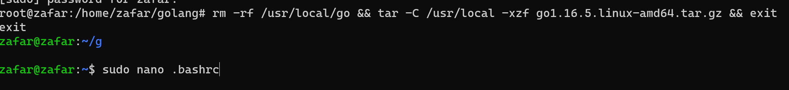
>Jika sudah tambahkan 1 lagi untuk mendownload engine golang nya dengan sintaks
```rm -rf /usr/local/go && tar -C /usr/local -xzf go1.16.5.linux-amd64.tar.gz && exit```
>Jika sudah kita akan pindah ke folder root dengan perintah 'cd' lalu enter dan selanjutnya mencari file bernama '.bashrc' 


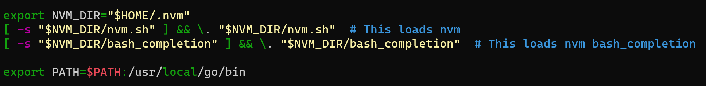
>Jika sudah masuk tambahkan teks untuk path nya dengan sintaks
```export PATH=$PATH:/usr/local/go/bin```

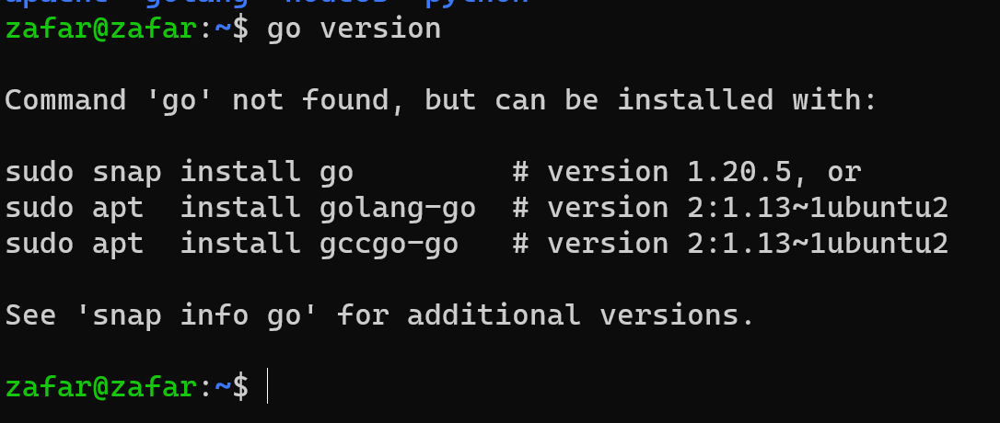
>Jika saat mengecek version golang blm bisa kita cukup menginstal nya lagi dengan perintah ```sudo snap install go```


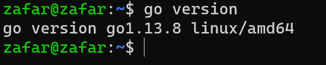
>Jika semua sudah terinstal baik engine dan golang nya silakan cek version nya ```go version``` maka akan menampilkan versi yang sudah terinstall


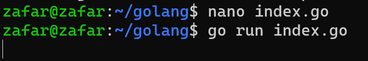
>Sekarang kita akan membuat file index.go bertujuan untuk mendeploy nya di web chrome 


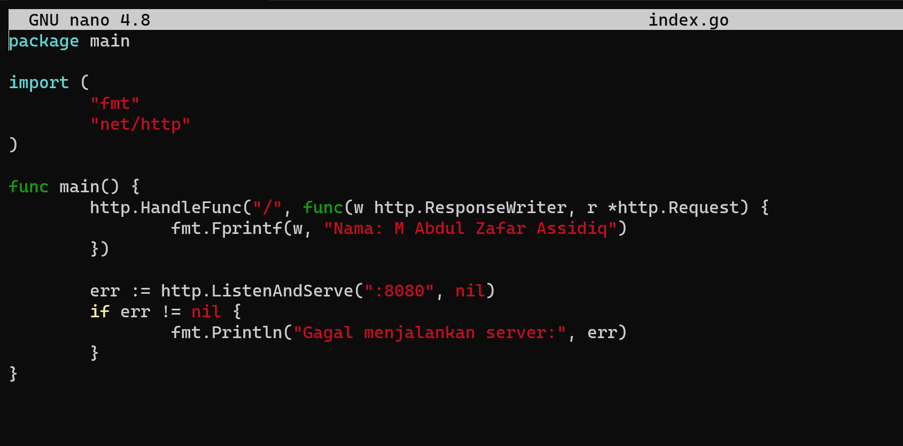
>Disini kita tinggal masukan sedikit script yang akan kita buat untuk mendeploy 
```
package main

import (
	"fmt"
	"net/http"
)

func main() {
	http.HandleFunc("/", func(w http.ResponseWriter, r *http.Request) {
		fmt.Fprintf(w, "Masukan Sesuka kalian")
	})

	err := http.ListenAndServe(":8080", nil)
	if err != nil {
		fmt.Println("Gagal menjalankan server:", err)
	}
}

```
>Jika sudah save dengan 'ctrl+x -> y' lalu enter


>Dan sekarang waktunya mencoba menjalankannya dengan sintaks `go run index.go`


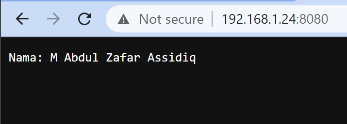
>untuk mengaksesnya cukup memasukan ip dan port yang ada di script sebelumnya
***
## Deploy Python Web

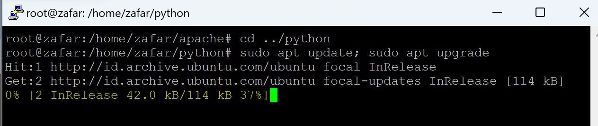
>Disini kita akan pindah folder terlebih dahulu jika ada di folder lain, jika sudah masuk maka sebelum memulai di update dan upgarde terlebih dahulu untuk sintaks tinggal masukan seperti ini 

```sudo apt update; sudo apt upgrade```

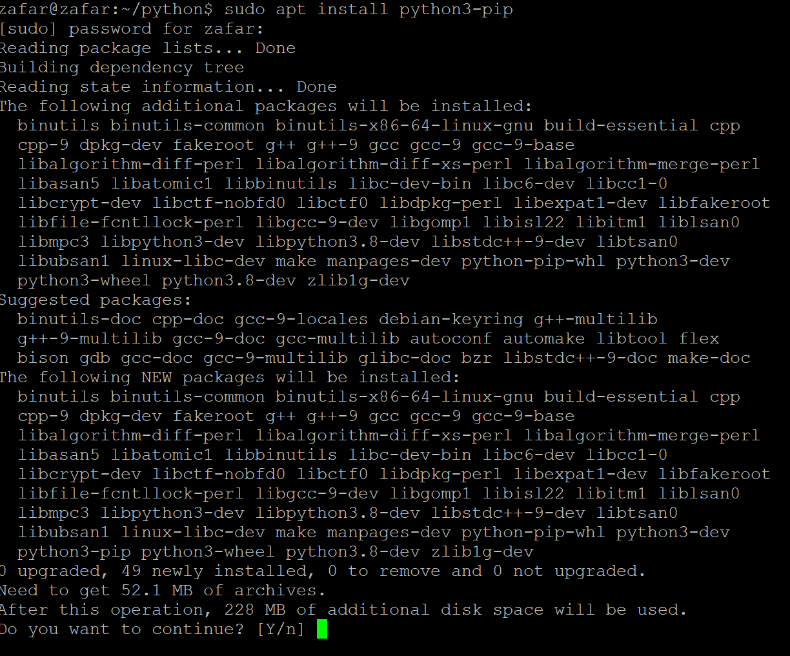
>Jika sudah ter update sekarang kita tinggal install sebuah package dari python3 dengan sintaks

```sudo apt install python3-pip```

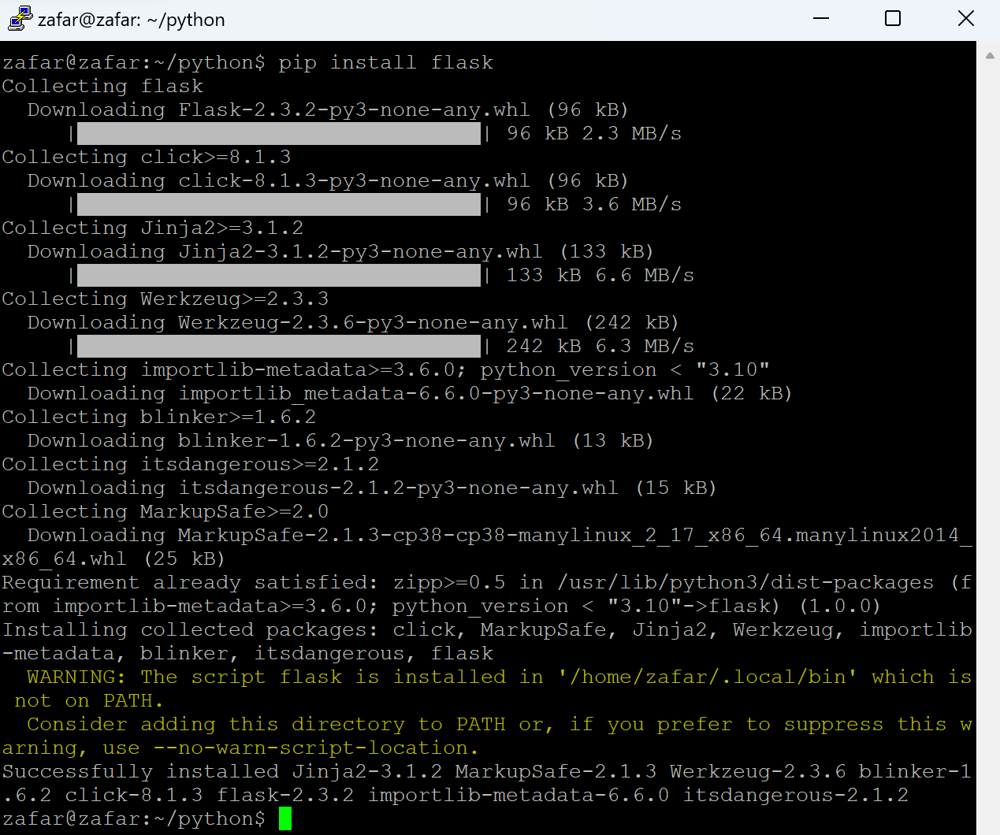
>Sama hal nya seperti pip flask juga sebuah package dari python 

```pip install flask```


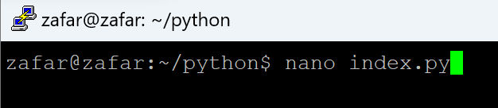
>Semua sudah terinstall sekarang tinggal membuat sebuah script untuk menjalankan sebuah program kecil

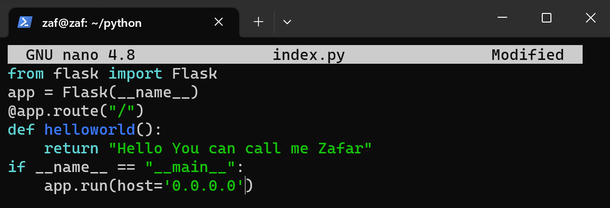
>Disini kita akan membuat sebuah aplikasi sederhana yang hanya menampilkan nama saja sintaks nya seperti ini

```
from flask import Flask
app = Flask(__name__)
@app.route("/")
def helloworld():
    return "Hello World"
if __name__ == "__main__":
    app.run(host='0.0.0.0')
```

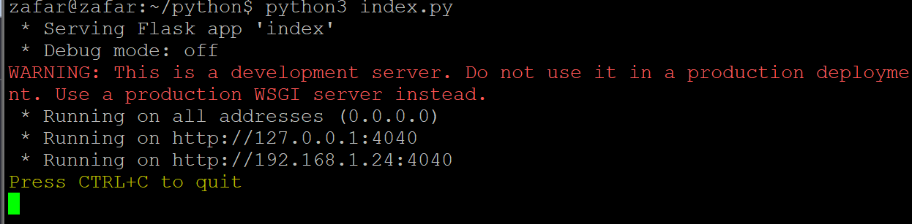
>Dan untuk menjalankannya cukup dengan sintaks `python3 index.py` nantinya akan muncul komen seperti dibawah ini dan nantinya akan berjalan di port 5000

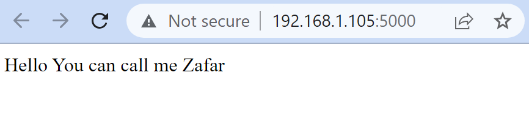
>Sekarang tingal di uji coba untuk dilihat hasil nya akan seperti diatas ini ketika kalian membuka nya dengan ip:5000
