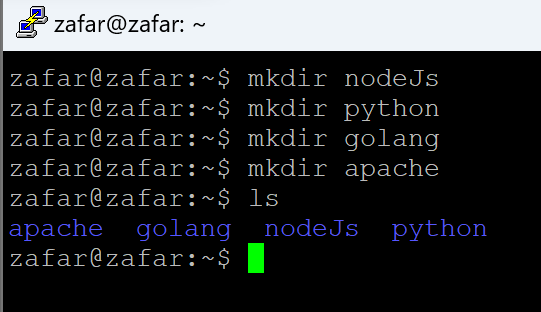
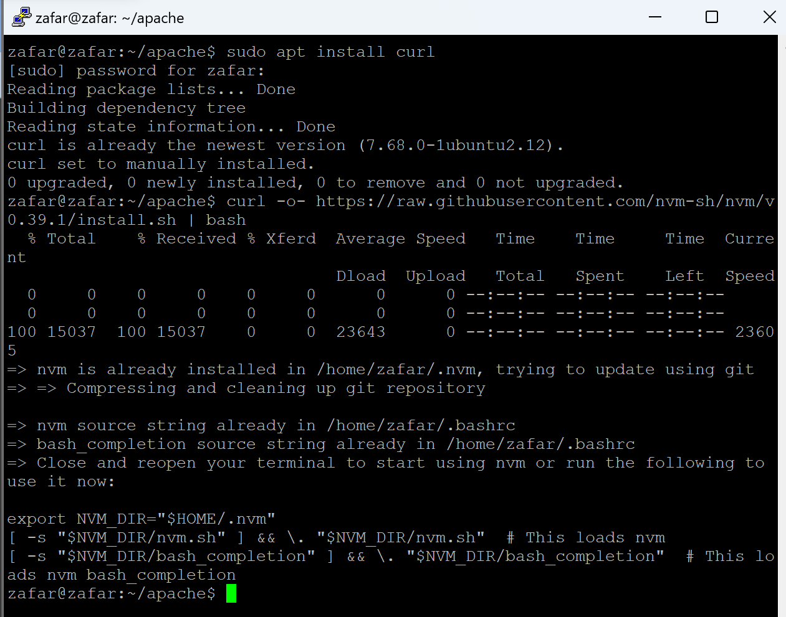
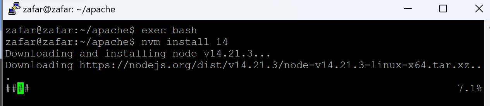
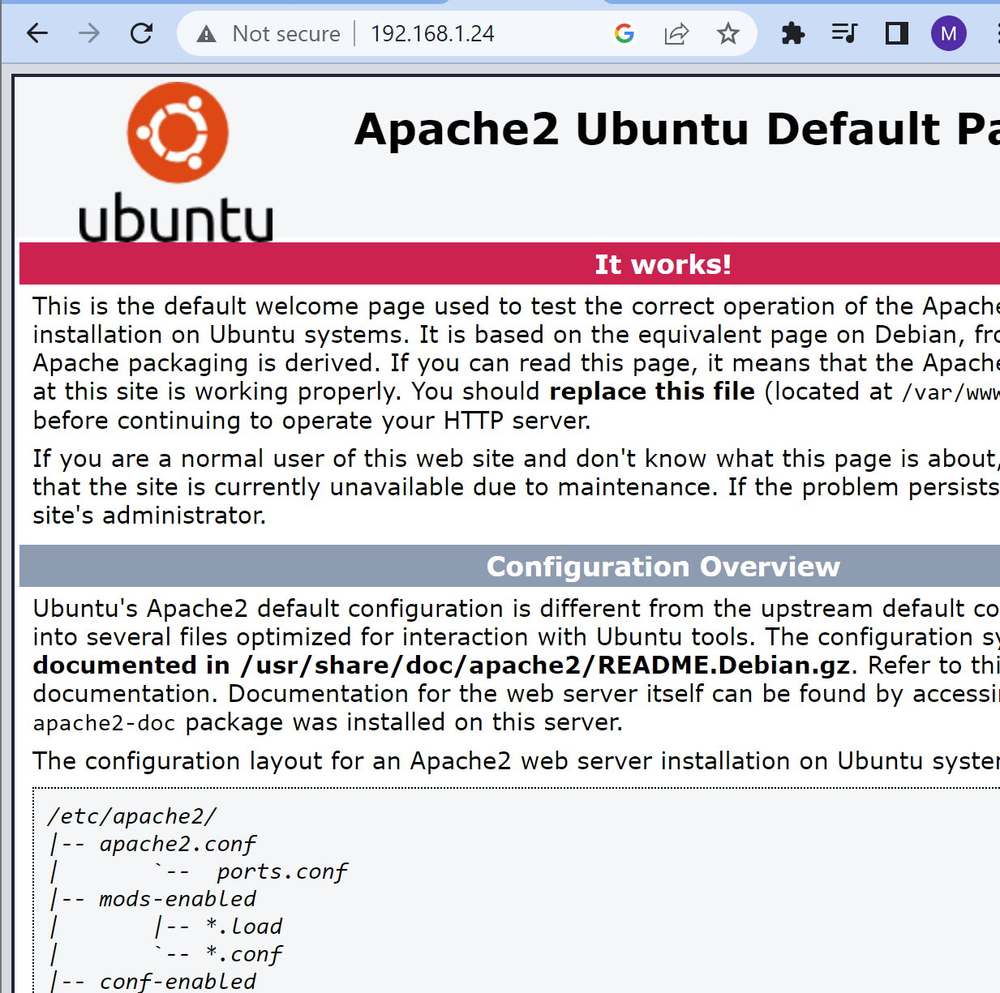

## install apache

>Baik kali ini kita akan menginstal apache kita akan menggunakan folder apache dengan perintah `cd apache`


>sebelum kita install apache2 nya kita akan menginstal yang kita butuhkan terlebih dahulu seperti di bawah ini 
```
curl -o- https://raw.githubusercontent.com/nvm-sh/nvm/v0.39.1/install.sh | bash
```


>setelah menginstal engine nya kita akan merefresh mesin nya `exec bash` membutuhkan nvm version 14 jadi kita akan menginstal nvm 14 dengan perintah `nvm install 14`


>Dan disini kita hanya perlu mengecek node dan npm nya seperti gambar ini 


>kita kan menginstal local tunel nya sebelum instal apache dengan sintaks `npm install -g localtunnel`


>Dan kini kita akan menginstal peran utama nya dengan sintaks `sudo apt install apache2` selanjutnya kita akan memilih y sebaga yes 


>Dan untuk hasilnya cukup untuk membuka di browser dengan sintak `IP:HOST`


>Kali ini kita akan mencoba di port 80 cukup kita masukan `lt --port 80` dan akan cek ip yang baru di buat oleh si port 80 dengan sintaks `wget -q -o- - ipv4.icanhazip.com` agar bisa mengakses localtunel apache nya 


>ketika masuk disini blm tahap terakhir, masukan url yang dibuat port 80dan  masukan ip yang di buat oleh port 80 yaitu disini saya mendapatkan ip `36.69.101.156` nanti akan dimasukan pas di endpoint IP


>Dan ini final nya akan tampil kurang lebih seperti ini 
***
## Install PM2 secara global

>Sebelum menjalankan pm2 install terlebih dahulu dengan perintah ```npm install pm2@latest -g``` 


>sekarang kita akan menjalankan pm2 dengan perintah ```pm2 start index.js```


>Saat semua sudah siap sekarang tingal membuat aplikasi sederhana yang dimana kita hanya menampilkan nama kita untuk sintaks bisa salin dibawah ini 
```const express = require("express");
const app = express();
const port = 3000;

app.get("/", (req, res) => {
  res.send("Hello Nama Saya ");
});

app.listen(port, () => {
  console.log(`Example app listening on port ${port}`);
});
```


>Sama kaya diatas ini untuk python bedanya hanya nanti saat untuk mengakses nya ketika node js menggunakan port 3000 kalau python menggunakan port 5000 dan cara penulisan script ber-beda untuk sintaks pythin kurang lebih seperti ini 

```
from flask import Flask
app = Flask(__name__)
@app.route("/")
def helloworld():
    return "Hello World"
if __name__ == "__main__":
    app.run(host='0.0.0.0')
```


>Sudah semua untuk settingan script nodejs dan python3 sekarang kita akan menjalankan maasing masing aplikasi sederhana di dalam folder nya cara nya masuk kedalam folder nodejs lalu sintaksnya cukup mudah 

```
pm2 start zafar.js
```


>Sama halnya seperti nodejs kalau python3 perlu memasukan sedikit lebih panjang tapi kalian cukup menyalin sintaknya dibawah ini saja

```
pm2 start [namafile.py] --interpreter=python3
```
