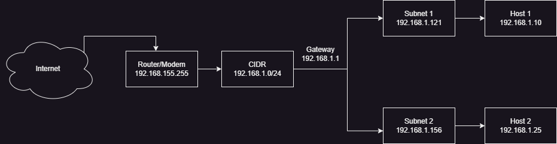

## Task C. Computer Networking 
1. - Ip public bisa digunakan dalam sekala besar dan tanpa batas bisa digunakan oleh banyk perangkat.
    - sedangkan ip private cuma digunakan di kantor,sekolah, ataupun perumahan ip ini biasa dimanfaatkan dalam sebuah jaringan lokal
   
  2. Host 1 terhubung ke subnet 1 dan memiliki alamat IP 192.168.1.121 di dalam rentang subnet tersebut. Host 2 terhubung ke subnet 2 dan memiliki alamat IP 192.168.1.156 di dalam rentang subnet tersebut. Kedua host ini menggunakan gateway 192.168.1.1 untuk mengirimkan data keluar dari jaringan lokal.

***