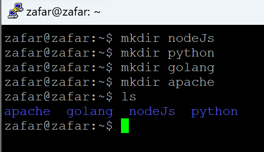
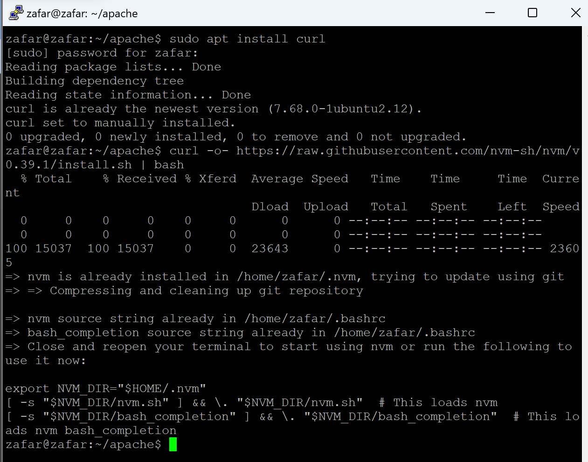
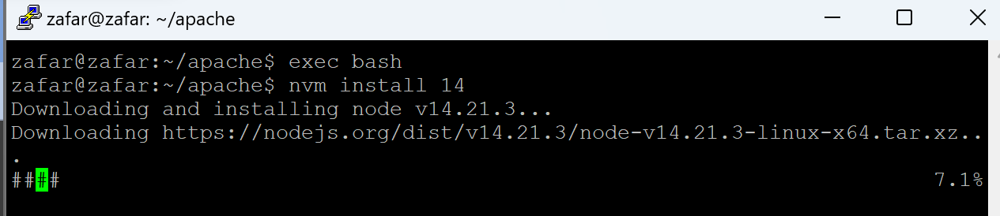
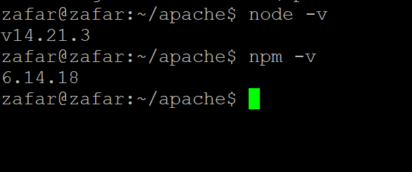
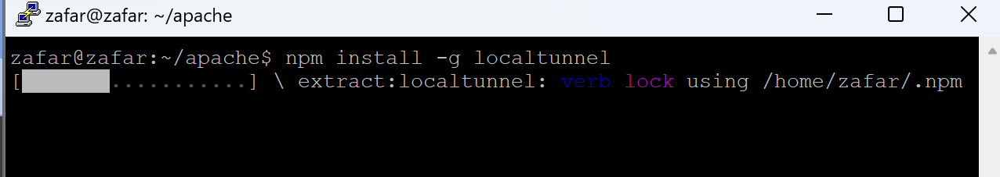
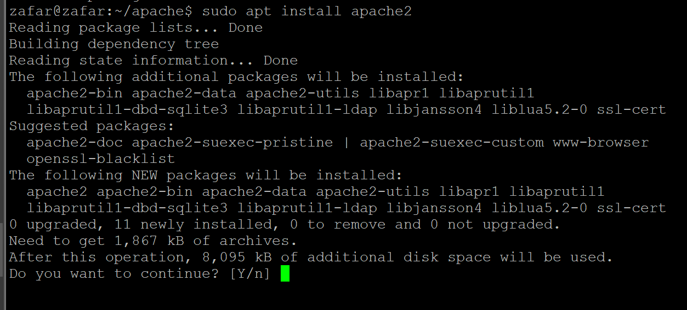
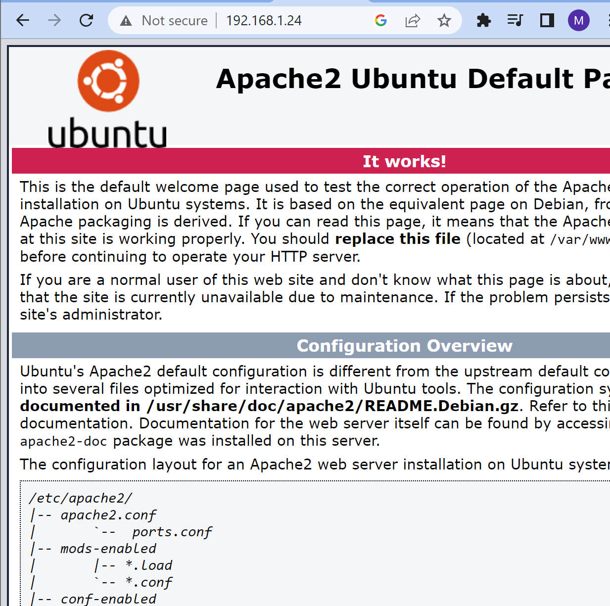
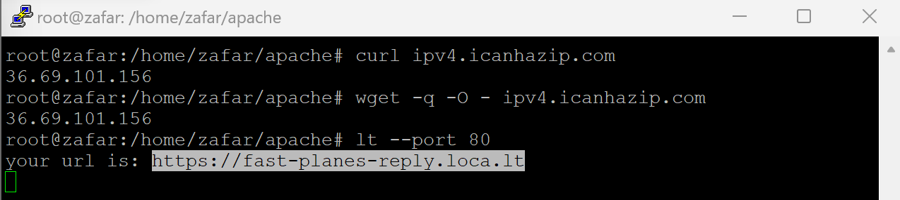
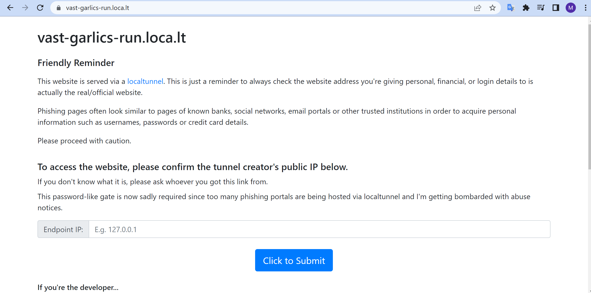
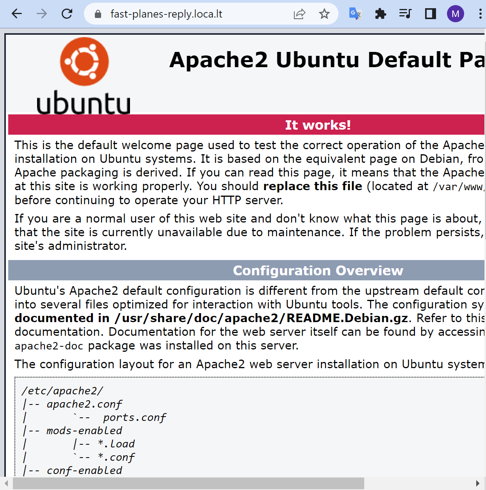

## Task B. Linux Shell
1. - whoami berguna agar kita tahu siapa user yang kita gunakan apakah 'Server ' atau 'Root'
    -  vi untuk membuat codingan atau scripts di ubuntu contoh vi index.js
    -  adduser/useradd untuk menambahkan membuat user baru tanpa diminta untuk mereset/mengatur password.

2. Bash adalah salah satu jenis shell umum digunakan dalam sitem operasi linux, dengan sintaks dan fitur yang lebih lengkap di bandingkan dengan shell bourne standar, shell bourne standar adlah versi lama dari sebuah bash dan sekarang sudah di perbarui menjadi bash
***
## install apache

>Baik kali ini kita akan menginstal apache kita akan menggunakan folder apache dengan perintah `cd apache`


>sebelum kita install apache2 nya kita akan menginstal yang kita butuhkan terlebih dahulu seperti di bawah ini 
```
curl -o- https://raw.githubusercontent.com/nvm-sh/nvm/v0.39.1/install.sh | bash
```


>setelah menginstal engine nya kita akan merefresh mesin nya `exec bash` membutuhkan nvm version 14 jadi kita akan menginstal nvm 14 dengan perintah `nvm install 14`


>Dan disini kita hanya perlu mengecek node dan npm nya seperti gambar ini 


>kita kan menginstal local tunel nya sebelum instal apache dengan sintaks `npm install -g localtunnel`


>Dan kini kita akan menginstal peran utama nya dengan sintaks `sudo apt install apache2` selanjutnya kita akan memilih y sebaga yes 


>Dan untuk hasilnya cukup untuk membuka di browser dengan sintak `IP:HOST`


>Kali ini kita akan mencoba di port 80 cukup kita masukan `lt --port 80` dan akan cek ip yang baru di buat oleh si port 80 dengan sintaks `wget -q -o- - ipv4.icanhazip.com` agar bisa mengakses localtunel apache nya 


>ketika masuk disini blm tahap terakhir, masukan url yang dibuat port 80dan  masukan ip yang di buat oleh port 80 yaitu disini saya mendapatkan ip `36.69.101.156` nanti akan dimasukan pas di endpoint IP


>Dan ini final nya akan tampil kurang lebih seperti ini