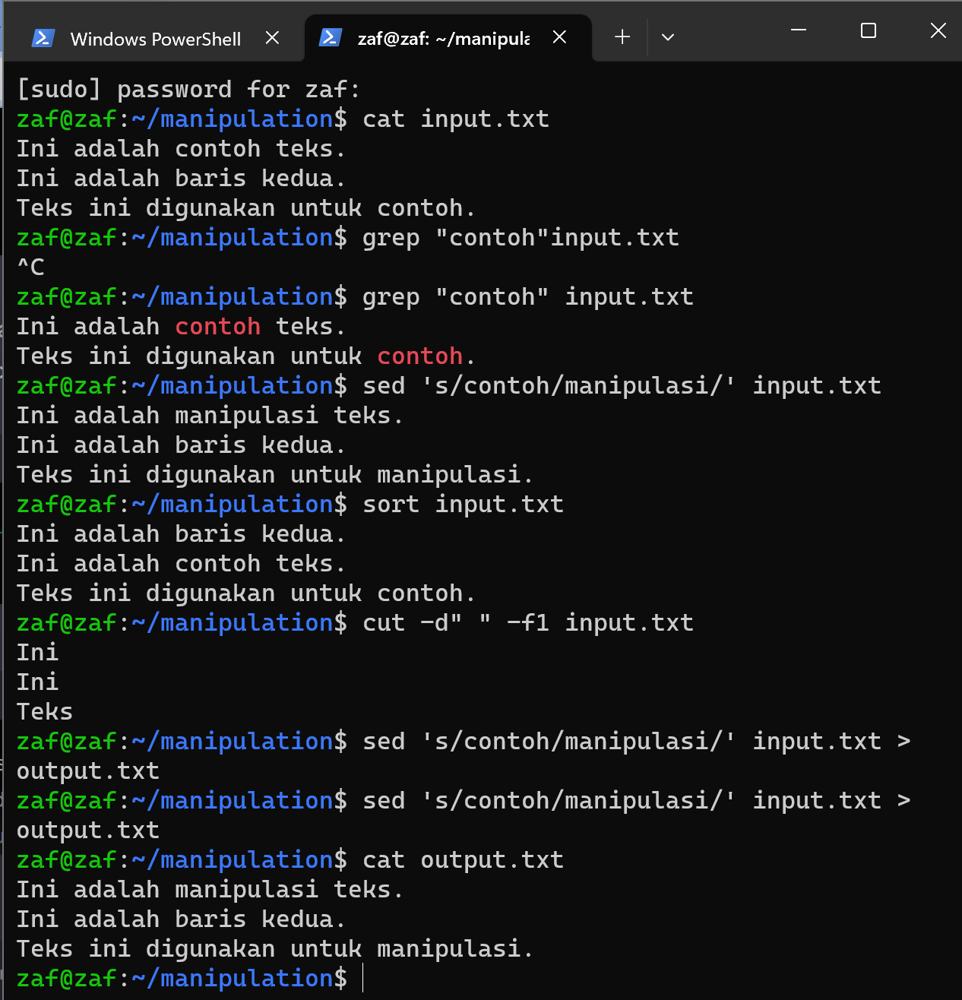

## Manage Terminal

1. sebelum memulai text manipulation harus mempunyai 1 file txt untuk contoh jika blm ada silakan buat dan isi sesuka kalian
2. `cat` untuk membaca sebuah file cat juga bisa menggabungkan dan mengedit tanpa harus masuk ke teks editor
3. `grep` grep bisa dipakai ketika mencari sebuah kata atau menghitung jumlah kata
4. `sed` bisa mereplace atau menganti sebuah kata di dalam file
5. `sort` sort akan mengurutkan urutan teks dari terkecil sampai terbanyak
6. `cut` bisa dijadikan mengambil kata pertama atau sesuai permintaan kita
***
## HTOP

1. `CPU` adalah di mana kita bisa tau berapa core yang kita punya

2. `Mem` keseluruhan memury yang terpakai

3. `swp`kita bisa tau bahwa ada memo cadangan

4. `tasks`seluruh aplikasi yang sedang berjalan di server

5. `load avarege` sebuah rata rata aplikasi yang berjalan 

6. `uptime`memberi tahu kita berapa lama server kita hidup

7. `pid`sebuah nomor proses id yang berjalan di linux

8. `virt` memory yang terpakai 

9. tool lengkapnya dari htop bisa dilihat di f1 (help)

10. untuk keluar dari htop cukup tekan f10
