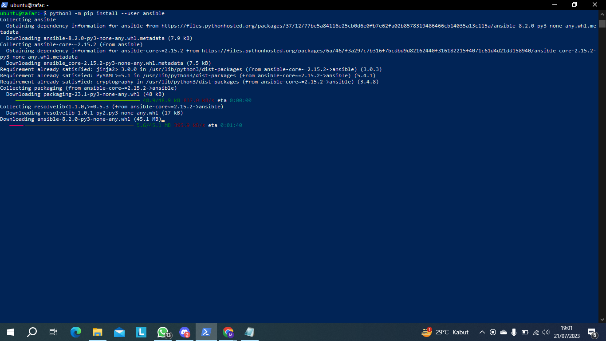
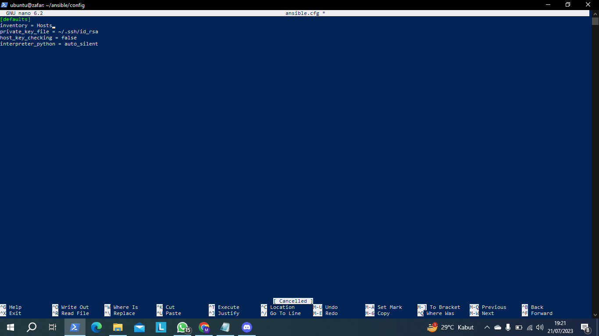
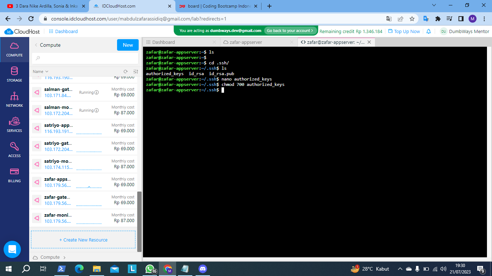

Instalasi ansible dibutuhkan python pip, gunakan command dibawah ini untuk verifikasi python pada linux ubuntu
```
python3 -m pip -V
```


```
curl https://bootstrap.pypa.io/get-pip.py -o get-pip.py
python3 get-pip.py --user
```


>jika sudah jalankan `python -V` jika sudah ada terinstal maka jalankan kode dibaawah ini yang bertujuan instalasi ansible

```
python3 -m pip install --user ansible
```


> jika sudah terinstal maka jalankan ansible --version

dan jika kalau belum terinstal namun sudah menjalankan instalasi sebelumnya coba dengan kalian copy code ini
```
sudo cp .local/bin/ansible /usr/local/bin
```
selanjutnya pada ansible saya membuat folder bernama ansible yang isinya adalah 
- ansible.cfg
- Hosts
- [nama_file].yml  untuk konfigurasi ansible-playbook

```
ansible-playbook [name_file].yml
```





`ansible.cfg`
```
[defaults]
inventory = Inventory
private_key_file = ~/.ssh/id_rsa
host_key_checking = false
interpreter_python = auto_silent
```


```
[appserver]
103.179.56.36

[gateway]
103.179.56.141

[monitoring]
103.179.56.174

[all:vars]
ansible_user="zafar"
```


> selanjutnya masuk ke vm yang tadi sudah terbuat di terraform 



>masukan id.rsa.pub dari multipass atau local saya disini saya menggunakan multipass jika kalian menggunakan wsl atau virtual machine kalian bisa disesuaikan jika sudah disalan dan taro di authorized keys selanjutnya berikan akses `chmod 700 authorized keys`kegunaan nya untuk mengontrol tingkat akses file atau direktori untuk pemilik, grup, dan pengguna lainnya.


>jika sudah mari kita ping semuanya agar cepat dengan perintah `aansible all -m ping`


>untuk password disini saya menggunakan metode enskripsi dengan menggunakan whois


> jalankan `mkpasswd --method=sha-256` jalankan setelah itu akan meminta masukan password gunanya agar kalian memasukan password itu akan berubah menjadi enskripsi lalu buat file bernama `adduser.yml`

```
- become: true
  gather_facts: false
  hosts: all
  vars:
   - username: "zafar-dw"
   - password: "$5$DRKO9sF0Q1e4nvcW$5gWLCjmJNSBEgoBg.Bsv2k1c0gK4tUAVivqkNnnbIwB" #Zafar2501

  tasks:
    - name: "Creating User"
      ansible.builtin.user:
        groups: sudo
        name: "{{username}}"
        password: "{{password}}"
```


> sekarang disini kita akan jalankan docker di appserver pertama kalian buat file nya dulu namanya docker-installing.yml (penamaan bersifat opsional) jika sudah jalankan jika kalian tidak bisa membuat nya saya akan sediakan nya 

```
- become: true
  gather_facts: true
  hosts: appserver

  vars:
    registry_docker_username: "zafar"

  tasks:
    - name: Update apt module
      apt:
        update_cache: true
    - name: Install ca-cert, curl, gnupg
      apt:
        name:
          - ca-certificates
          - curl
          - gnupg
    - name: Install GPG key
      apt_key:
        url: "https://download.docker.com/linux/ubuntu/gpg"
    - name: Install docker repository
      apt_repository:
        repo: "deb https://download.docker.com/linux/ubuntu focal stable"
    - name: update apt module
      apt:
        update_cache: true
    - name: Replace old URL di source list docker
      replace:
        path: /etc/apt/sources.list
        regexp: "http://mirrors.idcloudhost.com/ubuntu"
        replace: "http://archive.ubuntu.com/ubuntu/"
    - name: Install docker engine
      apt:
        update_cache: true
        name:
          - docker-ce
          - docker-ce-cli
          - containerd.io
          - docker-buildx-plugin
          - docker-compose-plugin

    - name: Create group "docker"
      group:
        name: "docker"
        state: present

    - name: Create user "{{ registry_docker_username }}"
      user:
        name: "{{ registry_docker_username }}"
        state: present
        createhome: yes
        group: "{{ registry_docker_username }}"

    - name: Add user "{{ registry_docker_username }}" to group "docker"
      user:
        name: "{{ registry_docker_username }}"
        group: docker
        append: yes
```

> jika sudah sukses semua installasi docker maka kalian bisa cek di vm app server dengan perintah `sudo su (user)` selanjutny `docker version` jika sudah sekarang kita akan mencoba mendeploy aplikasi dengan membuat 2file dengan nama file `docker-compose.yml` nantinya docker compose akan di taruh di appserver sehingga akan menjalankan file bernama `wayshub-docker.yml` untuk isi masing masing file nya

`docker-compose.yml`
```
version: "3.3"

services:
  frontend:
    container_name: wayshub-fe
    image: zafarassidiq/wayshub-fe:latest
    ports:
      - "3000:3000"
```

`wayshub-docker.yml`
```
---
- name: Deploy wayshub-frontend
  hosts: appserver
  become: yes
  tasks:
    - name: Clone the repository
      git:
        repo: https://github.com/dumbwaysdev/wayshub-frontend.git
        dest: /home/zafar/wayshub-frontend
        version: main
      become_user: zafar

    - name: Copy docker-compose.yml to the remote host
      template:
        src: docker-compose.yml
        dest: /home/zafar/wayshub-frontend/docker-compose.yml
      become_user: zafar

    - name: Build and start the Docker containers
      command: docker-compose up -d
      args:
        chdir: /home/zafar/wayshub-frontend
      become_user: zafar
```
> Jika sudah jalankan dengan `ansible-playbook wayshub-docker.yml`


> dan kalian bisa akses disini dengan ip:port contoh `192.168.1.1:3000`


>Dan buat `nginx.yml` yang isinya untuk instal nginx akan mengarah ke gateway lalu akan membuat sebuah proxy dimana sebelumnya kita menjalankan aplikasi menggunakan ip dan port nanti nya akan dijalankan di domain yang sudah kita buat


```
---
- become: true
  gather_facts: false
  hosts: gateway
  tasks:
    - name: "install nginx"
      apt:
        name: nginx
        state: present
        update_cache: yes
    - name: "start nginx"
      service:
        name: nginx
        state: started
    - name: "Creating a file with content"
      copy:
        dest: "/etc/nginx/sites-enabled/frontend.conf"
        content: |
          server {
              server_name zafar.studentdumbways.my.id;

              location / {
                       proxy_pass http://103.179.56.36:3000;
              }
          }
    - name: "reload nginx"
      service:
        name: nginx
        state: reloaded
```


> dan kalian bisa akses dengan nama domain yang akan kalian buat tadi.
