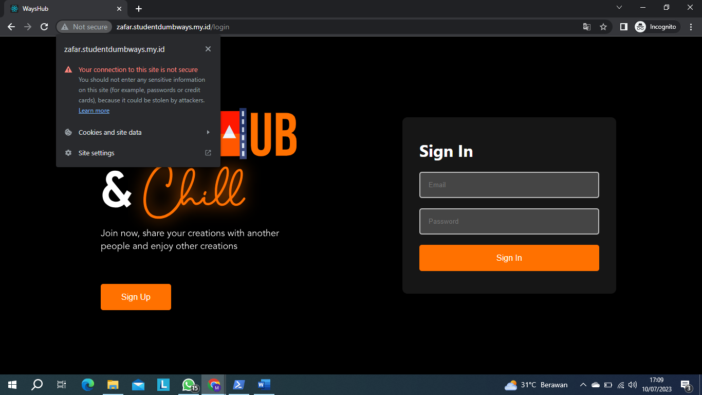
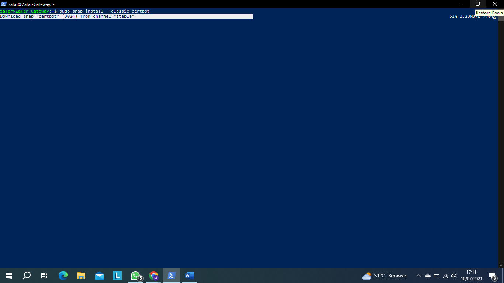
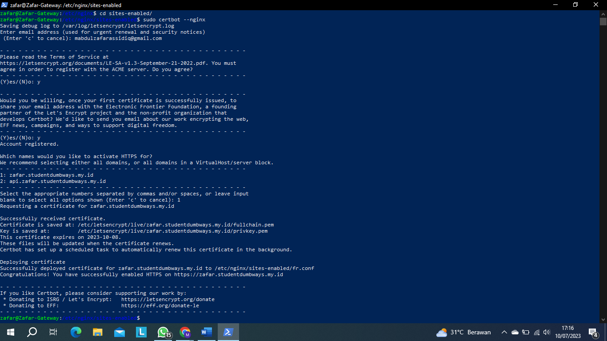

## Challenge SSL Certbot

**Sebelum memulai nya kita lihat di lambang gembok**

> Tampilan awal akan seperti ini akan ada keterangan warning sekarang kita akan hilangkan itu agar pengunjung merasa nyaman juga 

**Selanjutnya install terlebih dahulu yaitu dengan perintah sudo snap install --classic certbot**

> Tunggu dan biarkan full loading nya dan jika sudah selesai mari kita lanjut

>  Sekarang masuk kedalam `cd /etc/nginx/sites-enabled` tempat kita menyimpan configurasi sebelumnya,
>> Jika sudah jalankan perintah `sudo certbot --nginx` dan masukan email kita lalu enter dan seterusnya tekan Y sampai muncul perintah dimana pilihan domain yang kita buat pilih yang bagian frontend nya '1' selanjutnya tunggu saja sampai sertifikasi nya selesai jika sudah mari cek

> Jika sudah cek kembali seperti sebelumya yaitu di gemboknya dan akan tampil seperti ini dan sampai sini sudah selesai sertifikasi keamanan dan installasi certbot untuk ubah ke https Terimakasih