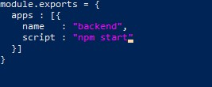

# Task A. Deploy Wayshub Frontend & Backend
Buatlah vm dengan spesifikasi
```
   - Appserver : 1 CPU, 2 GB RAM
   - Gateway : 1 CPU, 1 GB RAM
    Storage : 30 GB
```


> Dan disini kalian akan mengatur jenis iso yang akan kalian pakai  disini saya pakai ubuntu untuk version nya menggunakan 22.04 dan server indonesia 


> Disini kalian akan mengatur sesuai spesifikasi yang di butuhkan 


> Cek untuk mengetahui ssh jika blm silakan buat ssh-keygen di powershell windows atau cmd


> Jika sudah semua silakan masukin username dan password dan jangan lupa masukan ssh dibagian ssh ya


> Setelah sudah masukan git clone wayshub frontend nya dan backend nya


> jika sudah di clone mari kita install nvm version 14 nya 


> lanjut kita akan menginstall semua modul yang akan di butuhkan seperti gambar in 


> jika sudah terinstall maka jalankan dengan npm start 


> lalu masukan ip public yang sudah dibuat otomatis oleh si idclounds nya dalam port 3000

***
## Konfigurasi Myql 

> Pertama sebelum memasuki konfigurasi dan semua tentang mysql kita perlu instalasi terlebih dahulu dengan perintah `sudo apt install mysql-server`


> Jika sudah terinstall buat masuk lah ke mysql root untuk pembuatan akun dan pemberian hak akses


> Jalankan perintah ini untuk pembuatan user atau bisa di copy saja di bagian bawah ini dan berikan hak akses juga

``` 
CREATE USER 'zafar'@'localhost' IDENTIFIED WITH mysql_native_password BY 'zafar';
atau
CREATE USER 'zafar'@'%' IDENTIFIED BY 'zafar2501';
```
```
GRANT ALL PRIVILEGES ON *.* TO 'zafar'@'%' WITH GRANT OPTION;
```

> Selanjutnya melakukan setup keamanan di `sudo mysql_secure_installation`
 
***

## PM2 Ecosystem


> silakan buat pm2 ecosystem di masing masing folder yang sudah di clone di sebelum nya `pm2 ecosystem simple`


**Lalu edit script yang udah di buat dari sebelumnya yaitu ecosystem.config.js**
```
wayshub-frontend
name  : "frontend",
script: "npm start"
```

```
wayshub-backend
name  : "backend",
script: "npm start"
```

**Jika sudah di install pm2 dan sudah konfigurasi ecosystem silakan jalankan `pm2 start`**





***
## Integrasi Frontend TO Backend
**Sekarang kita akan mengintegrasi kan si frontend ke backend edit file api.js yang beralokasikan di frontend `wayshub-frontend/src/config`**


**lali masukan script yang sudah dibuat dibawah ini**
```
import axios from 'axios';

const API = axios.create({
    baseURL: "http://api.zafar.studentdumbways.my.id/api/v1"
});

const setAuthToken = (token) => {
    if(token){
        API.defaults.headers.common['Authorization'] = `Bearer ${token}`;
    } else {
        delete API.defaults.headers.common['Authorization'];
    }
}

export {
    API,
    setAuthToken
}
```

***
## Integrasi Backend To Sql
**Selanjutnya edit pada file config.json di dalam `wayshub-backend/config`**


***
## Squelize
