# Monitoring 
sebelum mulai persiapkan hal hal dibawah ini terlebih dahulu yaitu:
- Install doker di monitoring
- Siapkan scrip promethus jib dan grafana (atau bisa dijadikan satu saja)
- Periksa apakah node-exporter sudah berjalan dan periksa di appserver dan gateway nya

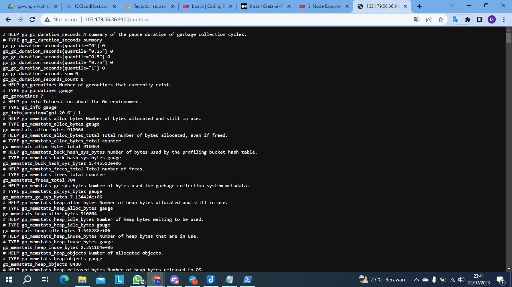
> Jika sudah kita akan masuk setingan scriptnya 


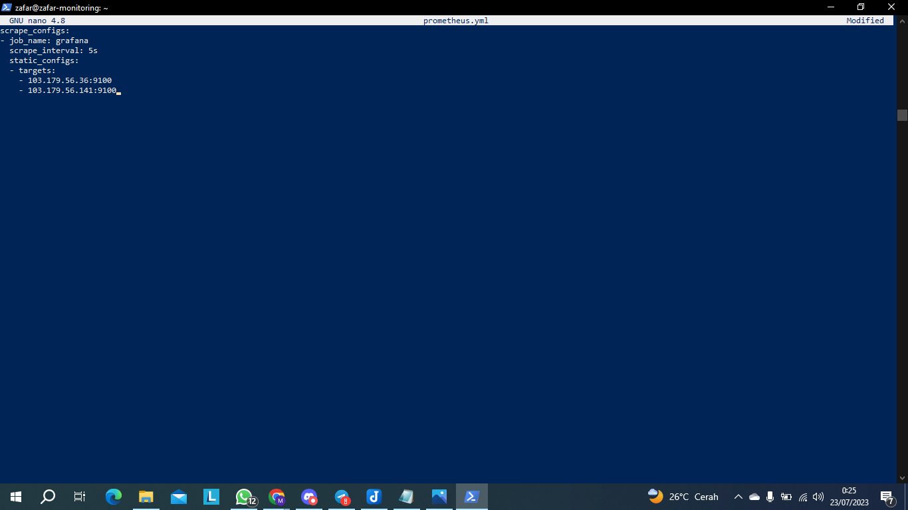
> Buat script seperti ini atau bisa di coppy saja

```
scrape_configs:
- job_name: grafana   
  scrape_interval: 5s
  static_configs:
  - targets:
    - masukan IP:PORT 
    - masukan IP:PORT
```


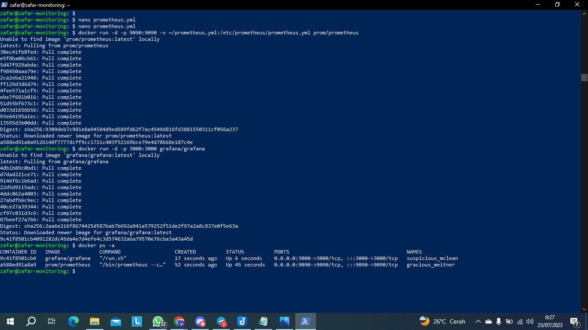
> Jika sudah kita langsung jalankan saja prometheus dan grafana nya seperti di gambar

```
docker run -d -p 9090:9090 -v ~/prometheus.yml:/etc/prometheus/prometheus.yml prom/prometheus
```
```
docker run -d -p 3000:3000 grafana/grafana
```


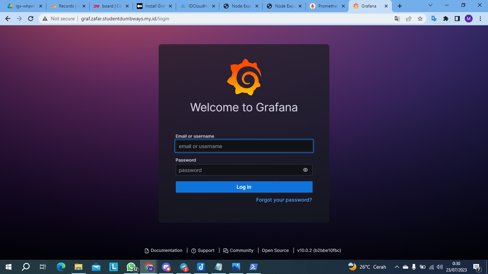
> Jika sudah bisa di cek pakai ip:host atau jika sudah membuat dns domain di cloudflare bisa di coba juga jalankan di web browser


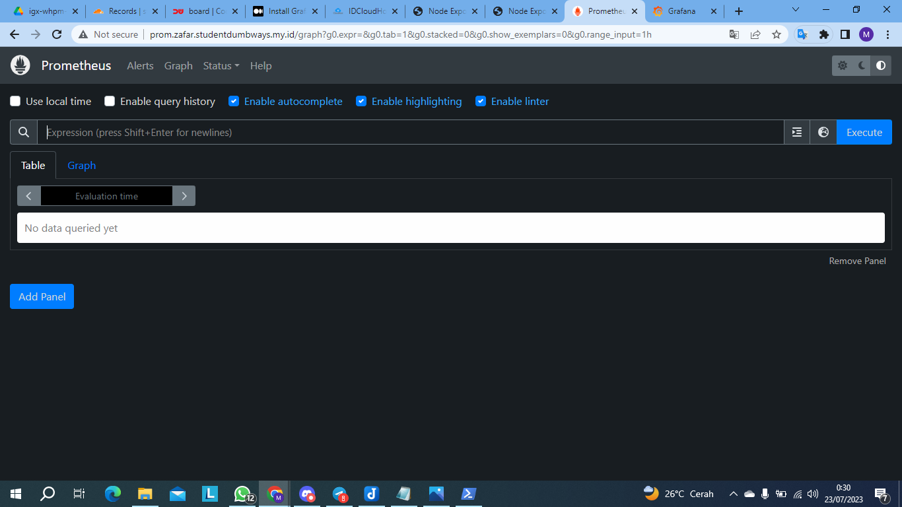


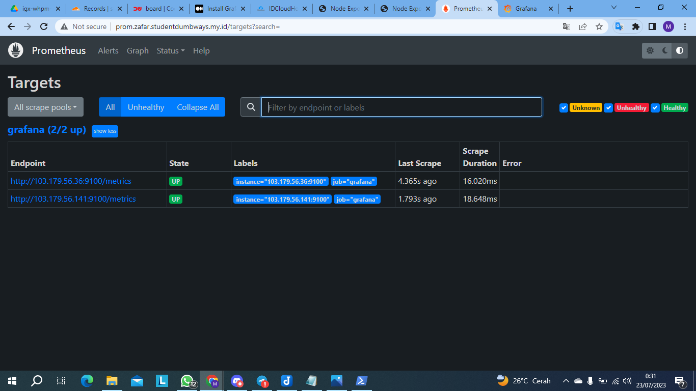
> disini saya akan memeriksa apakah sudah ada dns/ip server yang ditargetkan maka prometheus sudah terhubung dengan node-exporter

#Langkah Langkah Untuk Menambahkan Data Source
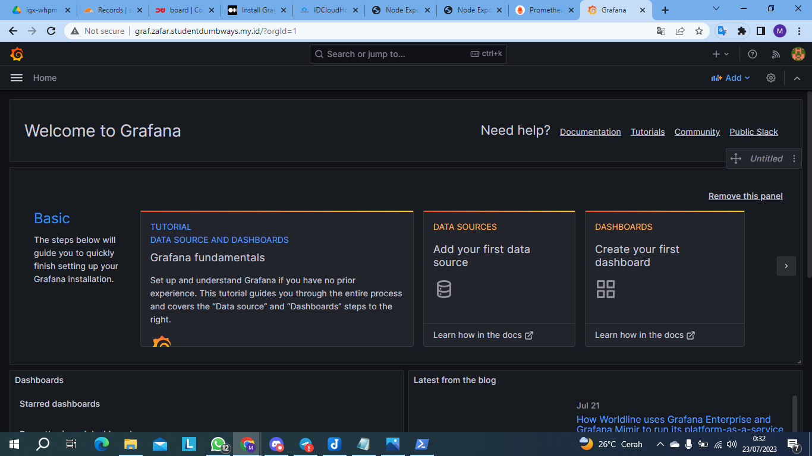


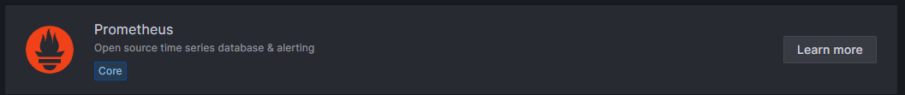


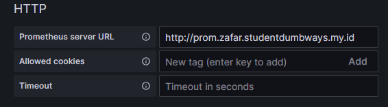


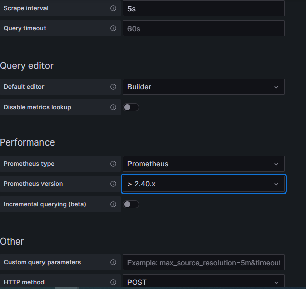


# Langkah Langkah Setup Dashboard
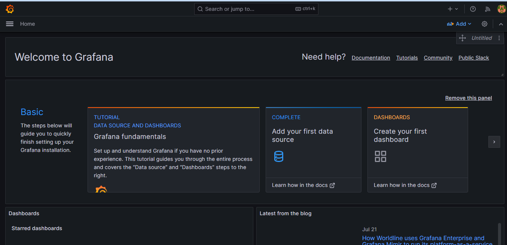


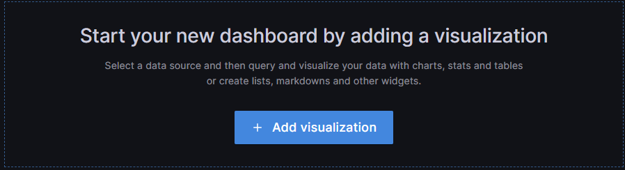


- CPU
```
100 - (avg by(instance) (irate(node_cpu_seconds_total{mode="idle", job="grafana"}[5m])) * 100)
```
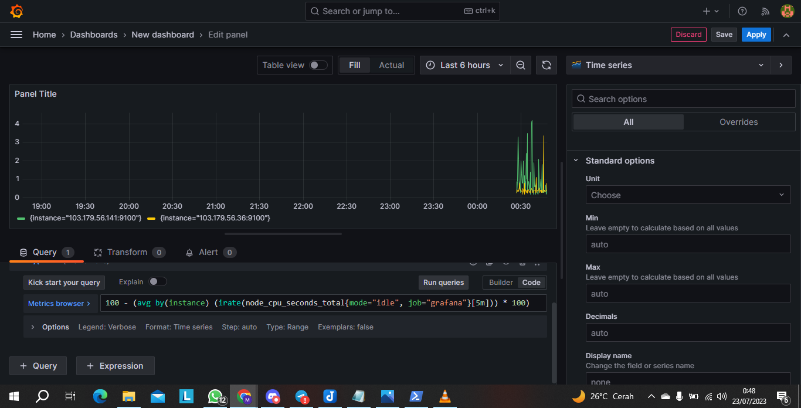

- Disk Usage
```
100 - (node_filesystem_avail_bytes / node_filesystem_size_bytes * 100)
```
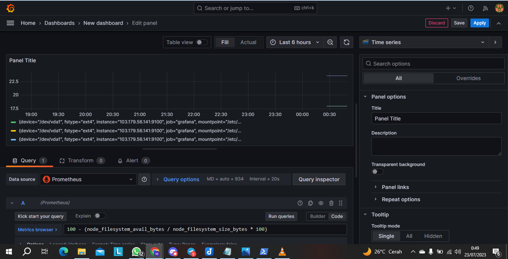

- Ram
```
100 * (1 - ((avg_over_time(node_memory_MemFree_bytes[10m]) + avg_over_time(node_memory_Cached_bytes[10m]) + avg_over_time(node_memory_Buffers_bytes[10m])) / avg_over_time(node_memory_MemTotal_bytes[10m])))
```
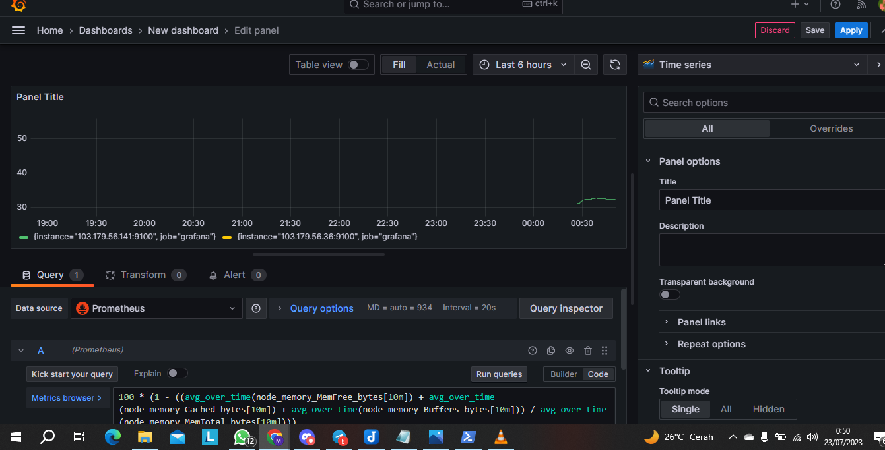


## Save Dashboard
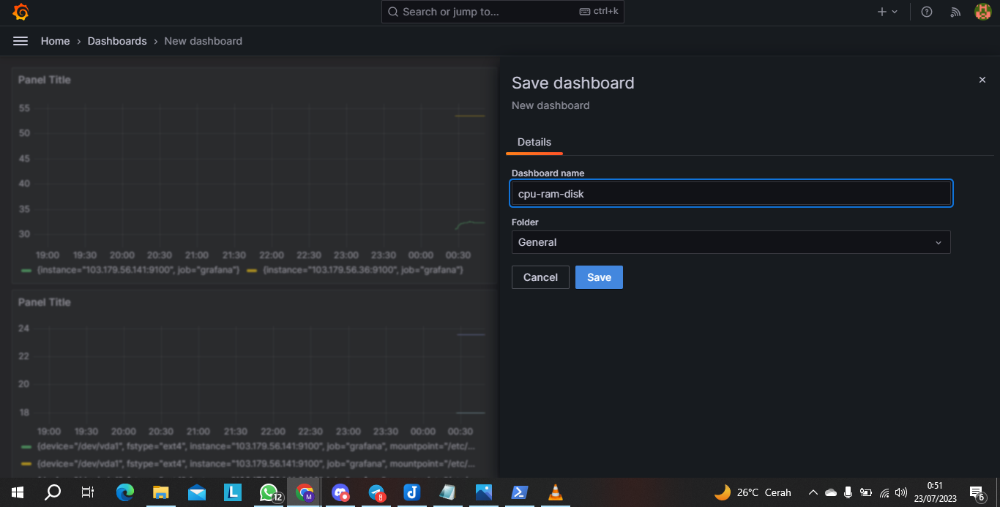
> di pojok kanan akan ada seperti lambang save dan masukan nama save yang akan kita mau masukan


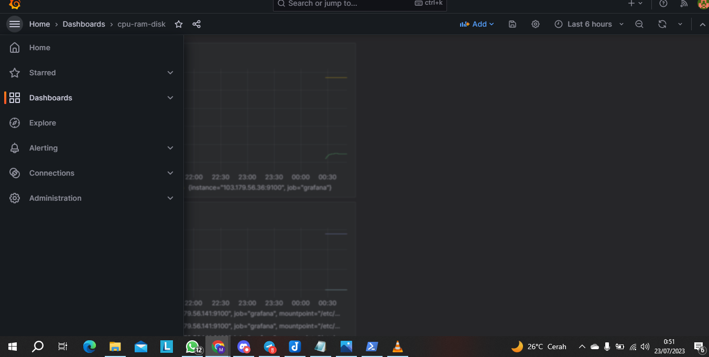
> Sekarang kita akan coba menambahkan bot alert ke discord pilih menu allerting


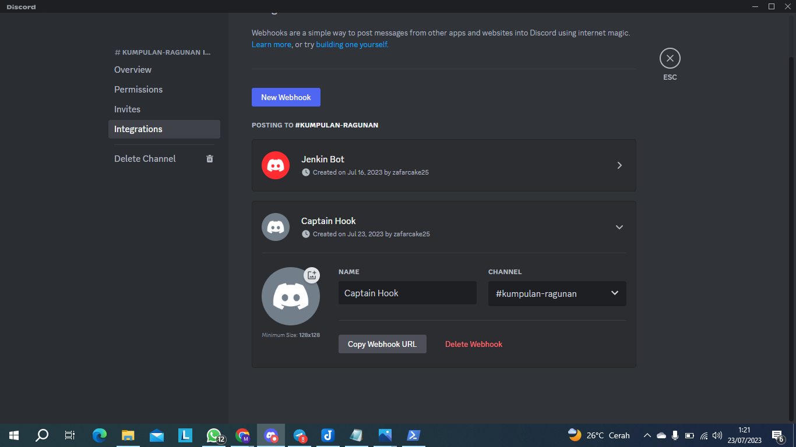
> bikin webhook terlebih dahulu lalu salin link webhook 


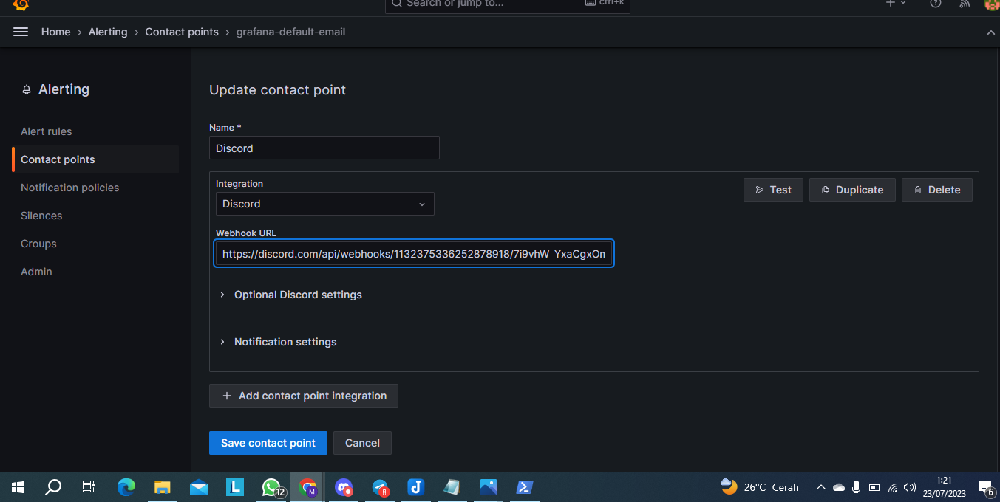
> buat seperti diatas ini tambahkan discord atau jika yang lain ada pilihannya sesuaikan yang akan kalian pilih


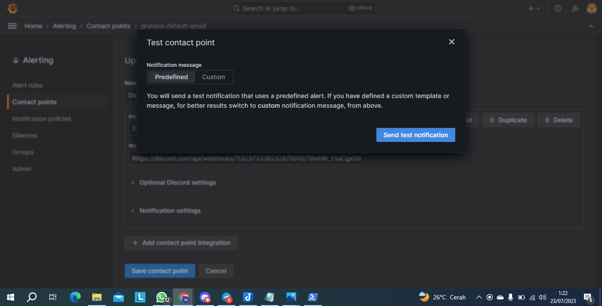
>Jika sudah kita akan coba test notification jika sudah maka akan muncul gambar yang dibawah ini


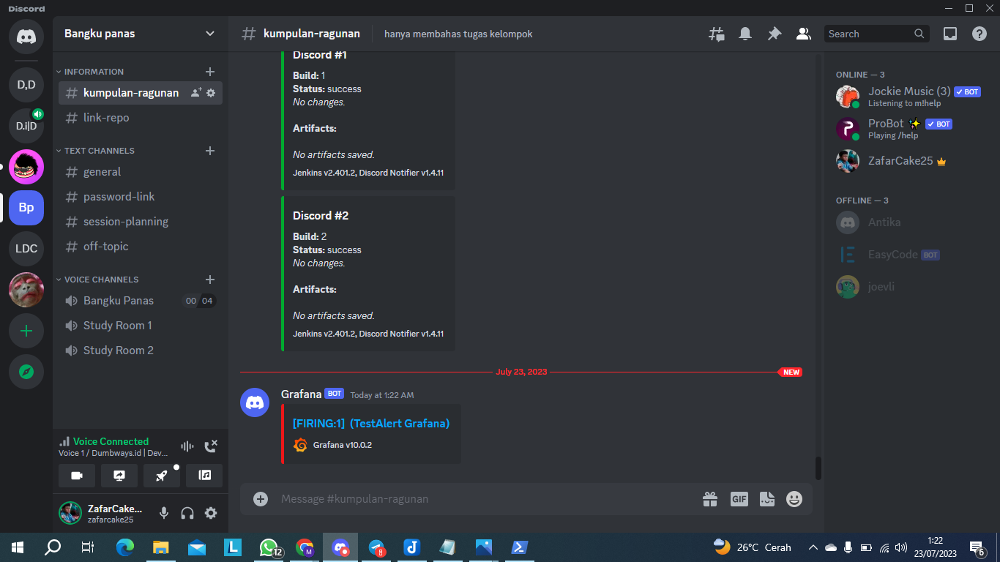

