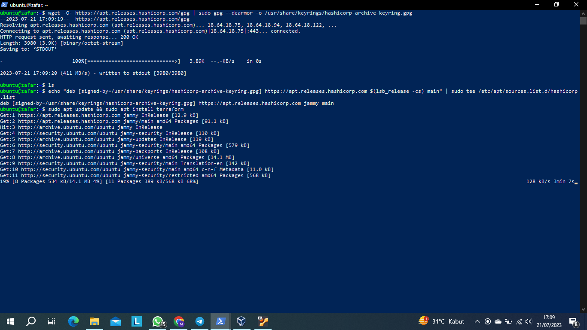
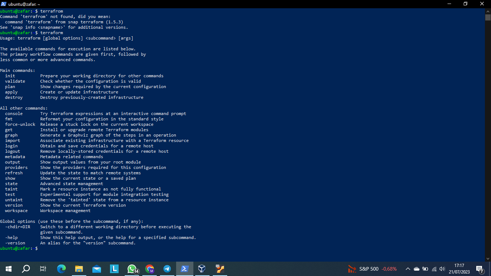
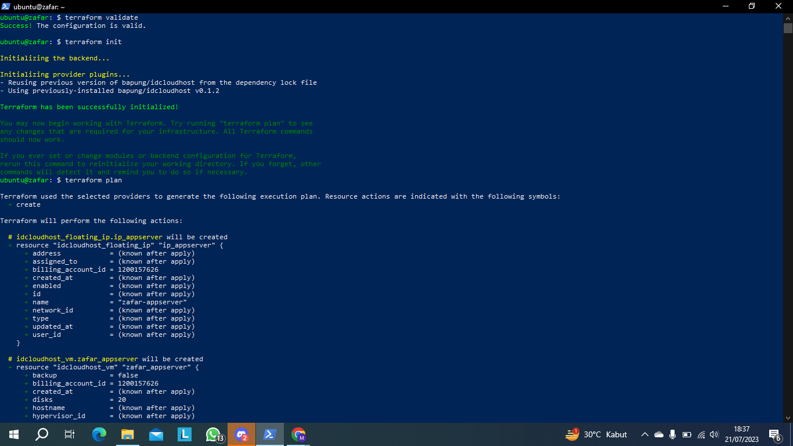
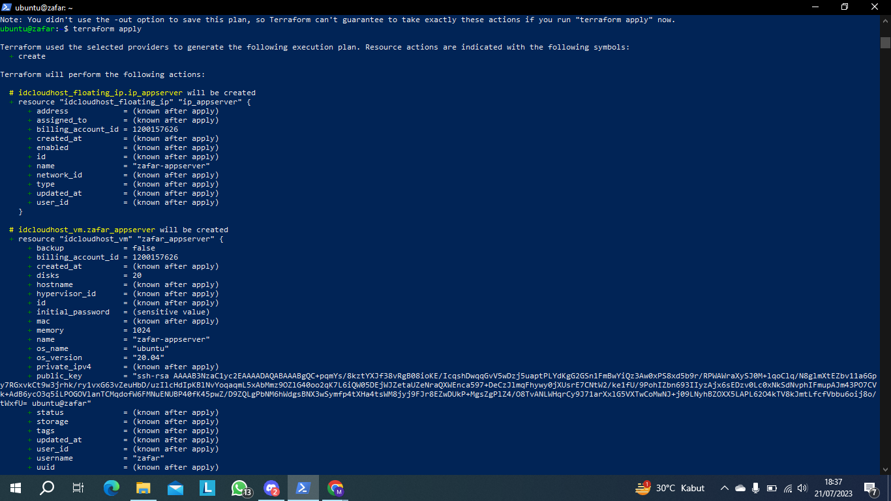
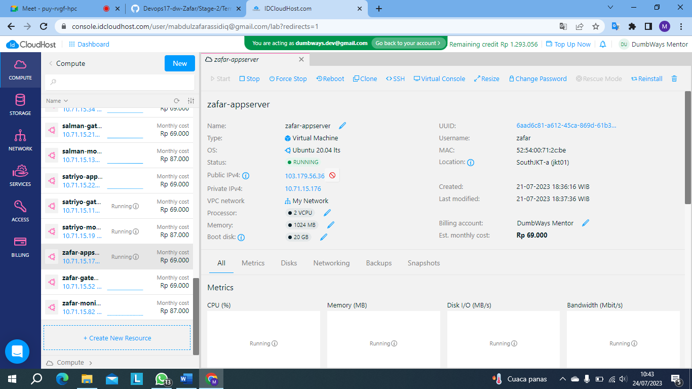

```
wget -O- https://apt.releases.hashicorp.com/gpg | sudo gpg --dearmor -o /usr/share/keyrings/hashicorp-archive-keyring.gpg
echo "deb [signed-by=/usr/share/keyrings/hashicorp-archive-keyring.gpg] https://apt.releases.hashicorp.com $(lsb_release -cs) main" | sudo tee /etc/apt/sources.list.d/hashicorp.list
sudo apt update && sudo apt install terraform
```



```
terraform
```

>Setelah  sudah menjalankan kode diatas saya memverifikasi apakah terraform sudah berhasil terinstall jika sudah dia akan muncul seperti diatas



>Kemudian buat file bernama main.tf yang isinnya adalah 

```
terraform {
  required_providers {
    idcloudhost = {
      source = "bapung/idcloudhost"
      version = "0.1.2"
    }
  }
}

provider "idcloudhost" {
    auth_token = "mTWvAHka6YmhUncBxKZyCpeL40C7Kyc0" # API Token from idcloudhost.com
    region = "jkt01"
}

resource "idcloudhost_vm" "zafar-appserver" {
    name = "zafar-appserver"
    os_name = "ubuntu"
    os_version= "20.04"
    disks = 20
    vcpu = 2
    memory = 1024
    username = "zafar"
    initial_password = "Zafar2501" # Combination of Uppercase, Lowercase & Numbers
    billing_account_id = "<BILLING_ACCOUNT_ID>" # Billing ID from idcloudhost.com
    public_key = "ssh-rsa AAAAB3NzaC1yc2EAAAADAQABAAABgQChkr+PQKUy5p91o2F7lg1QiJFYDdxcO7jdiDuPks/Mhb0dqKUN+p2Rh+raHWcw3i7YGKN/M9SpJdpfcFv7ywKuBz8ikK8nswm52OnsKSgzWH5SWRgymaO/O0sOqkro+5YW4xlY/w/P5K65sOaGmfnTih8uADZySHQJYEQjrLV1C+hyBXF/Kst44wvBPk4uFvtGUshhjuVFf4CxDOAOVDYDWYfSBGNfMulHt1SpMaT4+HKTlbaj7hc8QGRBCbWZMRCatQ95K/a2MddQ4AxfeK6WU+XIvD1lZeEY/qzNilCVjdxJoUcnWBOKssX/6fsDCGC5p2vC1xC2zLA7/H6rlkamvhwjmcspaLUUMfu/P9x9xMfJlAh8QeDB3pRjkJSq0Lze7RCEv1nMwvoCMElD6OoK7iCVkeXXPyCtcRZ8S1WLlqjf0QA1rrK1niV8EzedkjLkJu8VVHI8krIobICqVvMqs+AKnlLOKsyVTnXF4msx/FZsCUIX1kI6bgz0/LmS6vM= ubuntu@primary"
    backup = false
}

resource "idcloudhost_vm" "zafar-gateway" {
    name = "zafar-gateway"
    os_name = "ubuntu"
    os_version= "20.04"
    disks = 20
    vcpu = 2
    memory = 1024
    username = "zafar"
    initial_password = "Zafar2501" # Combination of Uppercase, Lowercase & Numbers
    billing_account_id = "<BILLING_ACCOUNT_ID>" # Billing ID from idcloudhost.com
    public_key = "ssh-rsa AAAAB3NzaC1yc2EAAAADAQABAAABgQChkr+PQKUy5p91o2F7lg1QiJFYDdxcO7jdiDuPks/Mhb0dqKUN+p2Rh+raHWcw3i7YGKN/M9SpJdpfcFv7ywKuBz8ikK8nswm52OnsKSgzWH5SWRgymaO/O0sOqkro+5YW4xlY/w/P5K65sOaGmfnTih8uADZySHQJYEQjrLV1C+hyBXF/Kst44wvBPk4uFvtGUshhjuVFf4CxDOAOVDYDWYfSBGNfMulHt1SpMaT4+HKTlbaj7hc8QGRBCbWZMRCatQ95K/a2MddQ4AxfeK6WU+XIvD1lZeEY/qzNilCVjdxJoUcnWBOKssX/6fsDCGC5p2vC1xC2zLA7/H6rlkamvhwjmcspaLUUMfu/P9x9xMfJlAh8QeDB3pRjkJSq0Lze7RCEv1nMwvoCMElD6OoK7iCVkeXXPyCtcRZ8S1WLlqjf0QA1rrK1niV8EzedkjLkJu8VVHI8krIobICqVvMqs+AKnlLOKsyVTnXF4msx/FZsCUIX1kI6bgz0/LmS6vM= ubuntu@primary"
    backup = false
}

resource "idcloudhost_vm" "zafar-monitoring" {
    name = "zafar-monitoring"
    os_name = "ubuntu"
    os_version= "20.04"
    disks = 20
    vcpu = 2
    memory = 2048
    username = "zafar"
    initial_password = "Zafar2501" # Combination of Uppercase, Lowercase & Numbers
    billing_account_id = "<BILLING_ACCOUNT_ID>" # Billing ID from idcloudhost.com
    public_key = "ssh-rsa AAAAB3NzaC1yc2EAAAADAQABAAABgQChkr+PQKUy5p91o2F7lg1QiJFYDdxcO7jdiDuPks/Mhb0dqKUN+p2Rh+raHWcw3i7YGKN/M9SpJdpfcFv7ywKuBz8ikK8nswm52OnsKSgzWH5SWRgymaO/O0sOqkro+5YW4xlY/w/P5K65sOaGmfnTih8uADZySHQJYEQjrLV1C+hyBXF/Kst44wvBPk4uFvtGUshhjuVFf4CxDOAOVDYDWYfSBGNfMulHt1SpMaT4+HKTlbaj7hc8QGRBCbWZMRCatQ95K/a2MddQ4AxfeK6WU+XIvD1lZeEY/qzNilCVjdxJoUcnWBOKssX/6fsDCGC5p2vC1xC2zLA7/H6rlkamvhwjmcspaLUUMfu/P9x9xMfJlAh8QeDB3pRjkJSq0Lze7RCEv1nMwvoCMElD6OoK7iCVkeXXPyCtcRZ8S1WLlqjf0QA1rrK1niV8EzedkjLkJu8VVHI8krIobICqVvMqs+AKnlLOKsyVTnXF4msx/FZsCUIX1kI6bgz0/LmS6vM= ubuntu@primary"
    backup = false
}

resource "idcloudhost_floating_ip" "ip-appserver" {
    name = "zafar-appserver"
    billing_account_id = "<BILLING_ACCOUNT_ID>" # Billing ID from idcloudhost.com
    assigned_to = idcloudhost_vm.zafar-appserver.id
}

resource "idcloudhost_floating_ip" "ip-gateway" {
    name = "zafar-gateway"
    billing_account_id = "<BILLING_ACCOUNT_ID>" # Billing ID from idcloudhost.com
    assigned_to = idcloudhost_vm.zafar-gateway.id
}

resource "idcloudhost_floating_ip" "ip-monitoring" {
    name = "zafar-monitoring"
    billing_account_id = "<BILLING_ACCOUNT_ID>" # Billing ID from idcloudhost.com
    assigned_to = idcloudhost_vm.zafar-monitoring.id
}
```
>Setelah membuat jalankan `terraform validate` ini akan mengecek apakah kita sudah berhasil apa blm untuk membuat vm di idch


>Jika sudah jalankan 3 code ini

```
terraform init
terraform aply
terraform plan
```





> Jika sudah cek kembali apakah sudah ada vm yang terbuat oleh main.tf sebelumnya jika sudah kita akan lanjutkan ke ansible
